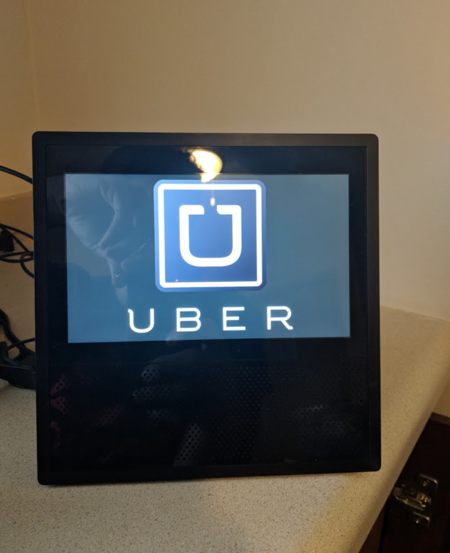

# Alexa_Call_an_Uber
Alexa skill that returns nearby Uber vehicle response time

## Skill Initiation

"Alexa, ask Uber when a vehicle will arrive"

> There is an {Uber X | Uber XL | Uber Pool} driver {Approximately | About | A little more than} {Time in Minutes} Minutes from your location

## Amazon Echo Show Example

"Alexa, Ask Uber when a vehicle will arrive"

> There is an Uber X driver approximately 8 Minutes from your location, and
> There is an Uber Pool driver approximately 12 Minutes from your location.
> If you would like to book a ride please download the Uber app on your smartphone.

  

